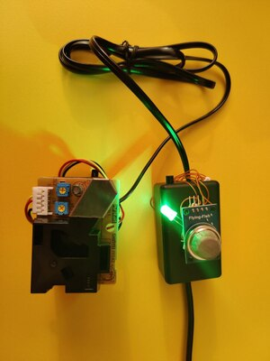

# PureAir device firmware

The firmware for the sensor device of the PureAir project. It collects internal temperature and co2 data, combining them with external
temperature and pollution informations to allow a smart ventilation of the house.
It then uploads all the data to a remote server for logging and automation and also lights up a led to show the best time to open the window.

## Build

- Install rust using the instructions [here](https://rustup.rs/)
- Install the [Rust Espressif compiler toolchain and the Espressif LLVM Clang toolchain](https://github.com/esp-rs/rust-build)
  - This is necessary, because support for the Xtensa architecture (ESP32 / ESP32-S2 / ESP32-S3) is not upstreamed in LLVM yet
- If using the custom Espressif Clang, make sure that you DON'T have a system Clang installed as well, because even if you have the Espressif one first on your `$PATH`, Bindgen will still pick the system one
  - A suggested workaround that does not require uninstalling the system Clang is to do `export LIBCLANG_PATH=<path to the Espressif Clang lib directory>` prior to continuing the build process
- `cargo install ldproxy`
- Clone this repo: `git clone https://gitlab.com/harmonyos-hackathon/submissions/team13/pureair`
- Enter it: `cd pureair`
- Export two environment variables that would contain the SSID & password of your wireless network:
  - `export PUREAIR_WIFI_SSID=<ssid>`
  - `export PUREAIR_WIFI_PASS=<ssid>`
- Build: `cargo build` or `cargo build --release`

## Flash

- `cargo install espflash`
- `espflash /dev/ttyUSB0 target/[xtensa-esp32-espidf|xtensa-esp32s2-espidf|riscv32imc-esp-espidf]/debug/pureair`
- Replace `dev/ttyUSB0` above with the USB port where you've connected the board

**NOTE**: The above commands do use [`espflash`](https://crates.io/crates/espflash) and NOT [`cargo espflash`](https://crates.io/crates/cargo-espflash), even though both can be installed via Cargo. `cargo espflash` is essentially `espflash` but it has some extra superpowers, like the capability to build the project before flashing, or to generate an ESP32 .BIN file from the built .ELF image.

## Alternative flashing

- You can also flash with the [esptool.py](https://github.com/espressif/esptool) utility which is part of the Espressif toolset
- Use the instructions below **only** if you have flashed successfully with `espflash` at least once, or else you might not have a valid bootloader and partition table!
- The instructions below only (re)flash the application image, as the (one and only) factory image starting from 0x10000 in the partition table!
- Install esptool using PYthon: `pip install esptool`
- (After each cargo build) Convert the elf image to binary: `esptool.py --chip [esp32] elf2image target/xtensa-esp32-espidf/debug/pureair`
- (After each cargo build) Flash the resulting binary: `esptool.py --chip [esp32] -p /dev/ttyUSB0 -b 460800 --before=default_reset --after=hard_reset write_flash --flash_mode dio --flash_freq 40m --flash_size 4MB 0x10000 target/xtensa-esp32-espidf/debug/pureair.bin`

## Monitor

- Once flashed, the board can be connected with any suitable serial monitor, e.g.:
  - ESPMonitor: `espmonitor /dev/ttyUSB0` (you need to `cargo install espmonitor` first)
  - Cargo PIO (this one **decodes stack traces**!): `cargo pio espidf monitor /dev/ttyUSB0` (you need to `cargo install cargo-pio` first)
    - Please run it from within the `pureair` project directory, or else the built ELF file will not be detected, and the stack traces will not be decoded!
  - Built-in Linux/MacOS screen: `screen /dev/ttyUSB0 115200` (use `Ctrl+A` and then type `:quit` to stop it)
  - Miniterm: `miniterm --raw /dev/ttyUSB0 115200`

## Config

To configure the firmware, take a look at the file src/config.rs, where you can change the gpio pins
associated with sensors and the server api address.

## Hardware

The board used for the project is a nodemcu with an esp32 microcontroller.

The following sensors are used to obtain the reads:

- Two ds18b20 for indoor and outdoor temperature measurements

  

- A MQ-135 sensor for indoor CO2 measurement

  

- A Grove Dust Sensor(PPD42NS) for outdoor pollution levels

  

To communicate between the internal and external modules, a normal RJ11 cable can be used,
with the following setup:

- Red wire -> 5v
- Black wire -> GND
- Yellow wire -> Temperature sensor one wire bus
- Green wire -> LO-time dust sensor signal

Here it is the final prototype:

