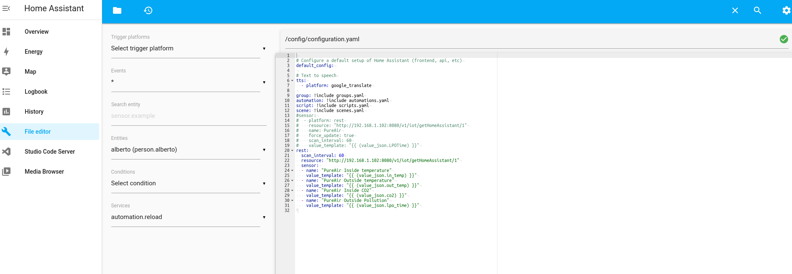
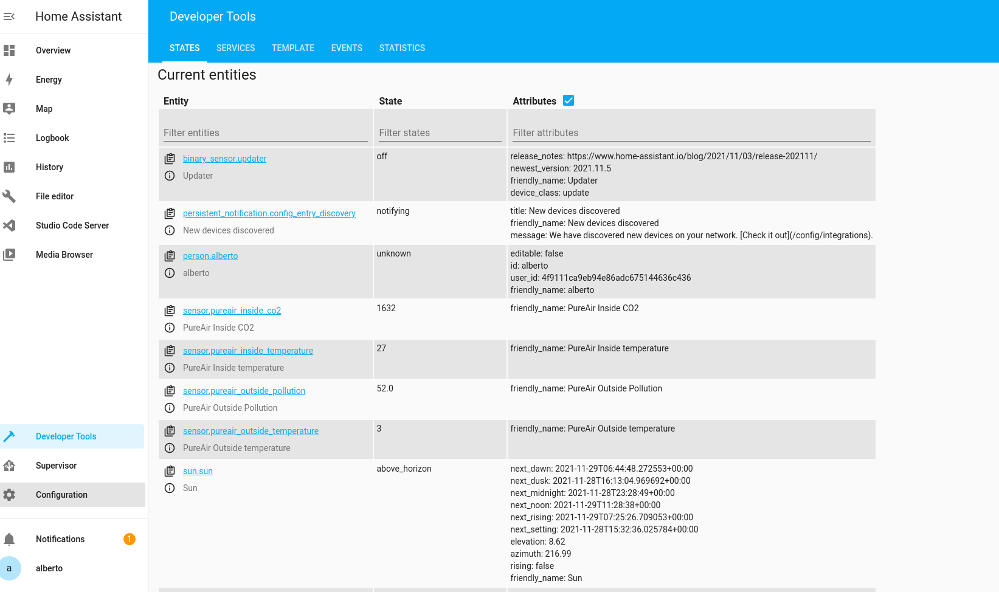

# Installation

- Add at the bottom of `configuration.yaml` ([See the docs](https://www.home-assistant.io/getting-started/configuration/)) the template you are interested. Then it should look like this:  
*(this configuration is using the Multi Sensor Template)*
- Edit the `HOSTNAME`, `DEVICE_ID` amd `PORT` (this one can be edited in the `docker-compose.yaml` which is located on the root of the project, by default the port is `8080`).
- Restart hassos and check if the sensor is correctly visible on the `Developer Tools > STATES` sub menu, it should look like this: 
- Edit your home screen and start automating! 

## Single Sensor Template
```
sensor:
  - platform: rest
    resource: "http://[HOSTNAME]:[PORT]/v1/iot/getHomeAssistant/[DEVICE_ID]"
    name: PureAir
    force_update: true
    scan_interval: 60
    value_template: "{{ (value_json.lpo_time) }}"
```

## Multi Sensor Template
```
rest:
  scan_interval: 60
  resource: "http://[HOSTNAME]:[PORT]/v1/iot/getHomeAssistant/[DEVICE_ID]"
  sensor:
  - name: "PureAir Inside temperature"
    value_template: "{{ (value_json.in_temp) }}"
  - name: "PureAir Outside temperature"
    value_template: "{{ (value_json.out_temp) }}"
  - name: "PureAir Inside CO2"
    value_template: "{{ (value_json.co2) }}"
  - name: "PureAir Outside Pollution"
    value_template: "{{ (value_json.lpo_time) }}"
```