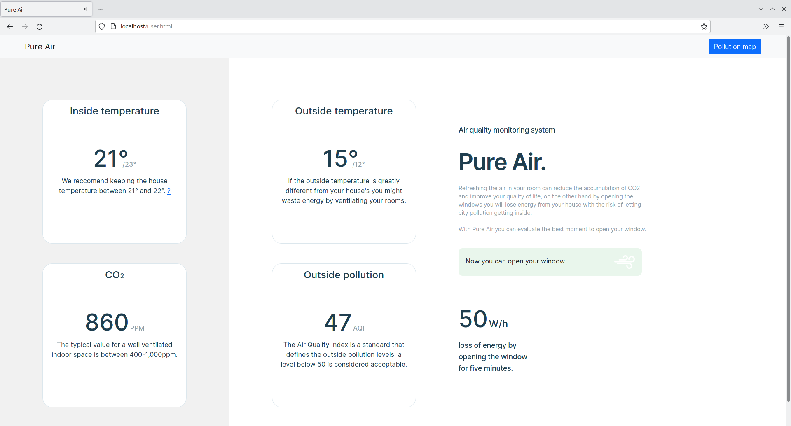
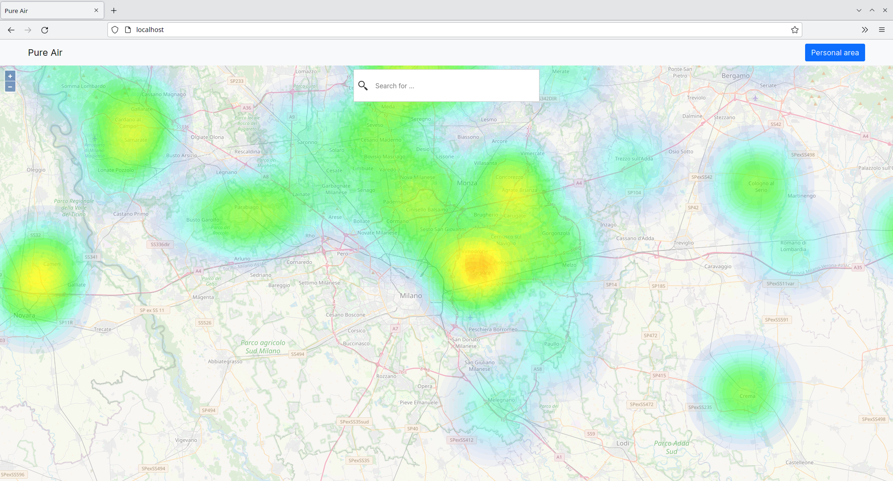
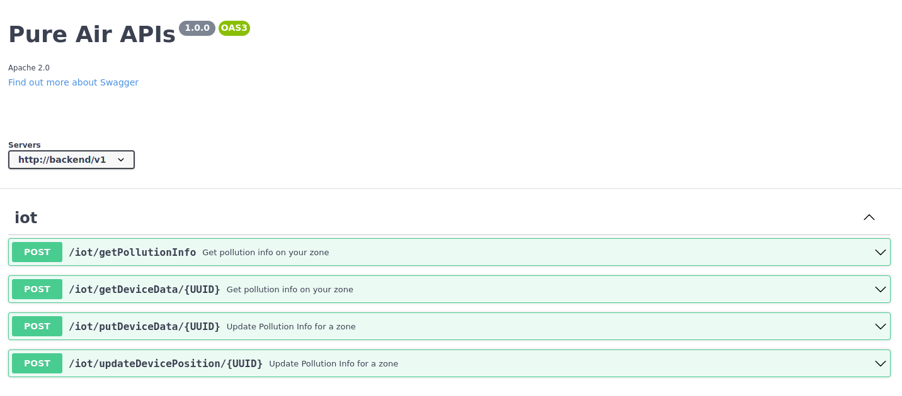

# Pure Air
Air quality monitoring system.

Pure Air stack is designed to be horizontally scalable through [kubernetes](http://kubernetes.io), both Frontend and
Backend are stateless and designed as a microservice that can be run in a container.

## Getting started

Run our web stack with:
```bash
$: docker-compose up
```
Once everything started up you can start sending data with your Pure Air IOT device, check out [Hardware](Hardware) for 
the source code.

## Frontend
Composed of a Private area and a [Private area](Frontend/user.html) and a [Public area](Frontend/index.html).

| Private area | Public area |
|---|---|
|   |  |

The private area empowers the user by giving him useful insights to make educated decisions, such as suggestsing 
the house ventilation schedule by fetching sensor data from the [Pure Air APIs](Backend).

The public area empowers the people by giving everyone a powerful tool to monitor the city pollution. This data can be 
used by the authorities to improve the well being of citizens or can be used by citizens themselves to force authorities to take action.

## Backend
Based on [sawagger.io](https://swagger.io/) and though to be scalable through container-based replication systems such as [kubernetes](https://kubernetes.io).

+ Three private APIs endpoints for the user private area

+ Public API endpoint `http://[BACKEND_URL]/v1/getPollutionInfo` for third parties to build upon,
easing the integration process by using the standard format [GeoJSON](https://geojson.org/)



## Database
MongoDB is our database, flexible enough and optimized for our needs is able to manage well 
GeoJSON data with its [2dsphere geospatial index](https://docs.mongodb.com/manual/core/2dsphere/)

For testing purposes we created a [populator](Database/populate/populate.py) script to create, fill and index the
database.

## License
For open source projects, say how it is licensed.