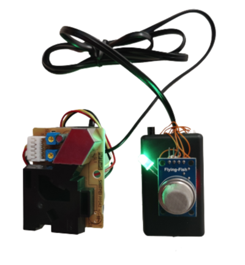

# Pure Air

Air quality monitoring system.

Pure Air stack is designed to be horizontally scalable through [kubernetes](http://kubernetes.io), both Frontend and
Backend are stateless and designed as a microservice that can be run in a container.

#### live demo available at [pure-air.cloud](https://pure-air.cloud)

## Getting started

Run our web stack with:

```bash
docker-compose up
```

Once everything started up you can start sending data with your Pure Air IOT device, check out [Hardware](Hardware) for
the source code.

## Frontend

Composed of a Private area and a [Private area](Frontend/user.html) and a [Public area](Frontend/index.html).

| Private area                        | Public area                       |
| ----------------------------------- | --------------------------------- |
|  |  |

The private area empowers the user by giving him useful insights to make educated decisions, such as suggestsing
the house ventilation schedule by fetching sensor data from the [Pure Air APIs](Backend).

The public area empowers the people by giving everyone a powerful tool to monitor the city pollution. This data can be
used by the authorities to improve the well being of citizens or can be used by citizens themselves to force authorities to take action.

## Backend

Based on [Swagger](https://swagger.io/) and [OpenAPI](https://swagger.io/specification/) and though to be scalable through container-based replication systems such as [kubernetes](https://kubernetes.io).

- Three private APIs endpoints for the user private area

- Public API endpoint `http://[BACKEND_URL]/v1/getPollutionInfo` for third parties to build upon,
  easing the integration process by using the standard format [GeoJSON](https://geojson.org/)


## Home assistant

We empower the user by providing home assist integration that can be used in conjunction within a smart home in a
domotic environment.


## Database

MongoDB is our database, flexible enough and optimized for our needs is able to manage well
GeoJSON data with its [2dsphere geospatial index](https://docs.mongodb.com/manual/core/2dsphere/)

For testing purposes we created a [populator](Database/populate/populate.py) script to create, fill and index the
database.

## Hardware

The board used for the project is a [nodemcu](https://components101.com/development-boards/nodemcu-esp8266-pinout-features-and-datasheet)
with an [esp32](https://www.espressif.com/sites/default/files/documentation/esp32_datasheet_en.pdf) microcontroller.

The following sensors are used to obtain the reads:
- Two [ds18b20](https://datasheets.maximintegrated.com/en/ds/DS18B20.pdf) for indoor and outdoor temperature measurements
- A [MQ-135](https://www.electronicoscaldas.com/datasheet/MQ-135_Hanwei.pdf) sensor for indoor CO2 measurement
- A PM2.5 detector [PPD42NS](https://www.mouser.com/datasheet/2/744/Seeed_101020012-1217636.pdf) for outdoor pollution levels

To communicate between the internal and external modules, a normal RJ11 cable can be used,
with the following setup:

- Red wire -> 5v
- Black wire -> GND
- Yellow wire -> Temperature sensor one wire bus
- Green wire -> LO-time dust sensor signal

Here it is the final prototype:



## Firmware

The firmware is written in [Rust](https://www.rust-lang.org/), a powerful, fast and secure language
that can target the esp32 chipset, with a full standard library support.

Rust has also a huge set of libraries, all open-source and hosted on [crates.io](https://crates.io/)

This allows faster code writing, while having much bigger safety than other low-level languages such as C or C++.

Under the hood the Rust standard library for esp32 calls the routines of the official open-source Espressif real time os.

For information about building and running the PureAir firmware, take a look at the [Hardware README](Hardware/README.md)

## License

[Apache 2.0](https://www.apache.org/licenses/LICENSE-2.0)
Copyright &copy; PureAir team
